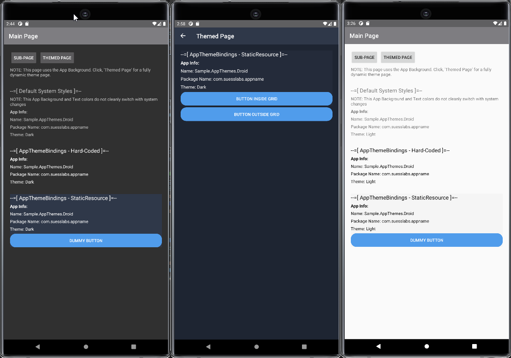

# .NET MAUI and Xamarin.Forms Themes

These examples demonstrate applying themes in you .NET MAUI and Xamarin.Forms apps!

You'll learn how to manually select and automatically set app themes, switching between dark/light based on system settings.

Author: [Damian Suess](https://www.linkedin.com/in/damiansuess/)

## Themes

## Sample Colors

### Light Theme - Detailed

| Name                          | Hex     | Usage |
|-------------------------------|---------|-------|
| Navigation Bar                | #7e7d81 | Header Navigation Bar Background
| Navigation Bar Text           | #ffffff | Header Navigation Bar Text
| Page Background               | White   | Background
| Primary                       | 242b3a  | Frames
| Actions                       | 509ceb  | Button faces, links, actionable items (combo down arrow)
| Control Borders               | 656a75  | Control box border
| CheckBox Checked Bg           | 339cf2
| CheckBox Unchecked Bg         | 283040
| Text                          | ffffff  | Text Color
| Text H1                       | ffffff  | Text Color
| Text H2                       | bec0c4  |
| Text H3                       |
| Tab A Selected Bg             | 3a4457  | Optional Selected Tab Item Background
| Tab B Selected Text Bg        | `transparent`  |
| Tab B Selected Text Fg        | ffffff (Bold)  |
| Tab B Selected Bottom Border  | 339cf2 |
| Tab B Unselected Text Fg      | 3a4457  | Optional Selected Tab Item Background
| ListView Background           | 283040  | Background of List box
| ListView Row A                | 283040  | Darker row color
| ListView Row B                | 2f3849  | Lighter row color
| ListView Selected Bg          | 27415e

### Dark Theme - Detailed

| Name                          | Hex     | Usage |
|-------------------------------|---------|-------|
| Navigation Bar                | 1e2532 | Header Navigation Bar Background
| Navigation Bar Text           | 2f3849 | Header Navigation Bar Text
| Background                    | 1e2532 | Background
| Primary                       | 242b3a | Frames
| Actions                       | 509ceb | Button faces, links, actionable items (combo down arrow)
| Control Borders               | 656a75 | Control box border
| CheckBox Checked Bg           | 339cf2
| CheckBox Unchecked Bg         | 283040
| Text                          | ffffff | Text Color
| Text H1                       | ffffff | Text Color
| Text H2                       | bec0c4 |
| Text H3                       |
| Tab A Selected Bg             | 3a4457 | Optional Selected Tab Item Background
| Tab B Selected Text Bg        | `transparent`
| Tab B Selected Text Fg        | ffffff (Bold)
| Tab B Selected Bottom Border  | 339cf2 |
| Tab B Unselected Text Fg      | 3a4457 | Optional Selected Tab Item Background
| ListView Background           | 283040 | Background of List box
| ListView Row A                | 283040 | Darker row color
| ListView Row B                | 2f3849 | Lighter row color
| ListView Selected Bg          | 27415e

### Dark Theme - Simple

| Name    | Hex     |
|---------|---------|
| BGColor | #282c34 |
| Links   | #409eff |
| Text    |         |

## Resources

* [Theme an Application](https://learn.microsoft.com/en-us/xamarin/xamarin-forms/user-interface/theming/theming)
* [Respond to Theme Changes](https://learn.microsoft.com/en-us/xamarin/xamarin-forms/user-interface/theming/system-theme-changes)
* Theme Colors
  * https://electronjs.org/apps/marktext
  * https://github.com/marktext/marktext
  * https://marktext.app/

## For Older Xamarin.Forms v4.x

Though this feature is not apart of Xamarin.Essentials (v1.3), it should be available in v1.4 according to [PR 927](https://github.com/xamarin/Essentials/pull/927) and [Enhancement 923](https://github.com/xamarin/Essentials/issues/923).

Normally, I just piecemeal parts of my larger projects but since Xamarin.Essentials is offering this feature soon, I'll try and use their naming conventions so the transition is smoother!

### Methods for theming

There are more than one way to perform this. Here are what others are doing out there

* [Simple Theming Method](https://docs.microsoft.com/en-us/xamarin/xamarin-forms/user-interface/theming)
  * [Theming Demo - GitHub](https://github.com/xamarin/xamarin-forms-samples/tree/master/UserInterface/ThemingDemo)
* [Material Themes](https://docs.microsoft.com/en-us/xamarin/android/user-interface/material-theme)
* [Old Docs](https://medium.com/@milan.gohil/adding-themes-to-your-xamarin-forms-app-3da3032cc3a1)
* [Find System Theme](https://codetraveler.io/2019/09/11/check-for-dark-mode-in-xamarin-forms/)
  * [Asked on StackOverflow](https://stackoverflow.com/questions/57879523/how-to-check-for-dark-mode-in-xamarin-forms)
